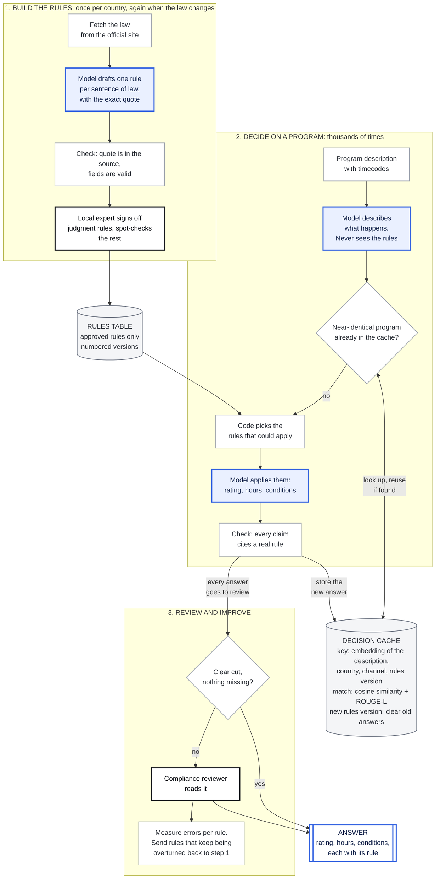

# Process diagram

Source for the Task 2 process diagram. `pipeline/build_diagrams.py` renders it.

```mermaid
flowchart TB

  subgraph L1 ["1. BUILD THE RULES: once per country, again when the law changes"]
    direction LR
    A1["Fetch the law<br/>from the official site"]:::code
    A2["Model drafts one rule<br/>per sentence of law,<br/>with the exact quote"]:::llm
    A3["Check: quote is in the source,<br/>fields are valid"]:::code
    A4["Local expert signs off<br/>judgment rules, spot-checks<br/>the rest"]:::person
    A1 --> A2 --> A3 --> A4
  end

  DB[("RULES TABLE<br/>approved rules only<br/>numbered versions")]:::store
  A4 --> DB

  subgraph L2 ["2. DECIDE ON A PROGRAM: thousands of times"]
    direction LR
    B1["Program description<br/>with timecodes"]:::code
    B2["Model describes<br/>what happens.<br/>Never sees the rules"]:::llm
    B3{"Near-identical program<br/>already in the cache?"}:::code
    B4["Code picks the<br/>rules that could apply"]:::code
    B5["Model applies them:<br/>rating, hours, conditions"]:::llm
    B6["Check: every claim<br/>cites a real rule"]:::code
    B1 --> B2 --> B3
    B3 -- "no" --> B4 --> B5 --> B6
  end

  CACHE[("DECISION CACHE<br/>key: embedding of the description,<br/>country, channel, rules version<br/>match: cosine similarity + ROUGE-L<br/>new rules version: clear old answers")]:::store
  DB --> B4
  B3 <-- "look up, reuse<br/>if found" --> CACHE
  B6 -- "store the<br/>new answer" --> CACHE

  subgraph L3 ["3. REVIEW AND IMPROVE"]
    direction LR
    C1{"Clear cut,<br/>nothing missing?"}:::code
    C2["Compliance reviewer<br/>reads it"]:::person
    C3["Measure errors per rule.<br/>Send rules that keep being<br/>overturned back to step 1"]:::code
    C1 -- "no" --> C2 --> C3
  end

  OUT[["ANSWER<br/>rating, hours, conditions,<br/>each with its rule"]]:::out
  B6 -- "every answer<br/>goes to review" --> C1
  C1 -- "yes" --> OUT
  C2 --> OUT

  classDef llm fill:#eaf0ff,stroke:#2f5fe0,stroke-width:2.5px,color:#17264d
  classDef code fill:#ffffff,stroke:#9aa0ab,stroke-width:1.5px,color:#2b2f36
  classDef person fill:#ffffff,stroke:#111318,stroke-width:2.5px,color:#111318
  classDef store fill:#f4f5f7,stroke:#6b7280,stroke-width:1.5px,color:#2b2f36
  classDef out fill:#ffffff,stroke:#2f5fe0,stroke-width:2.5px,color:#17264d
```
